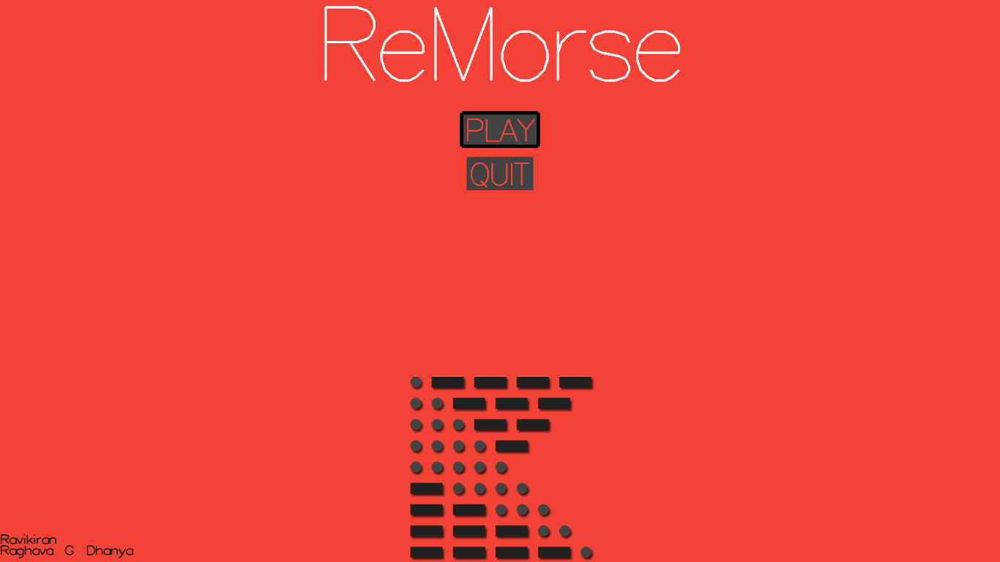
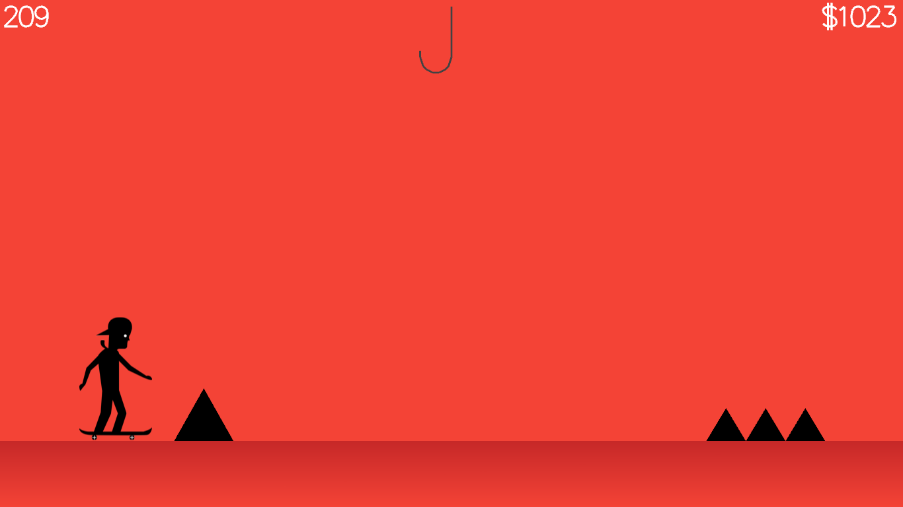
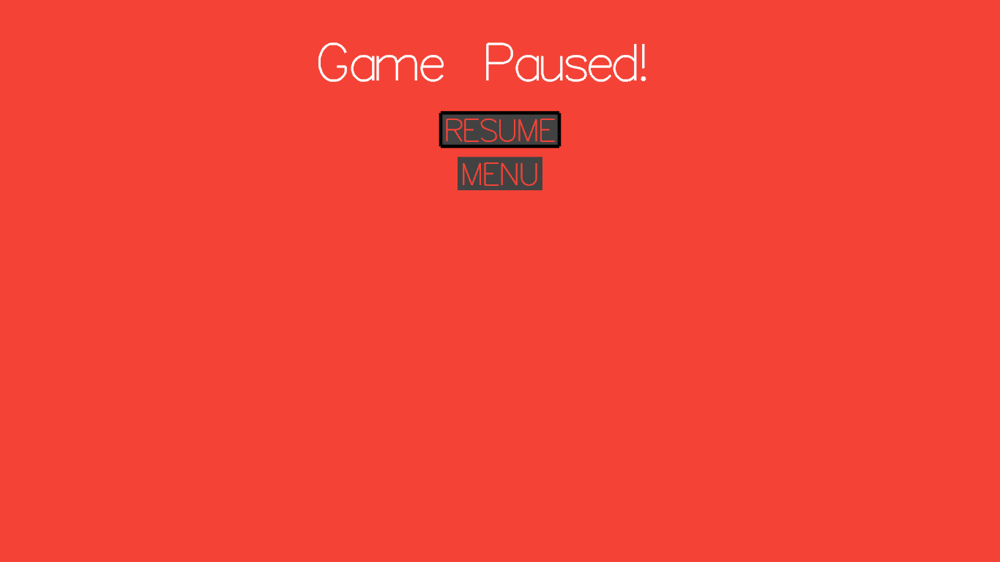
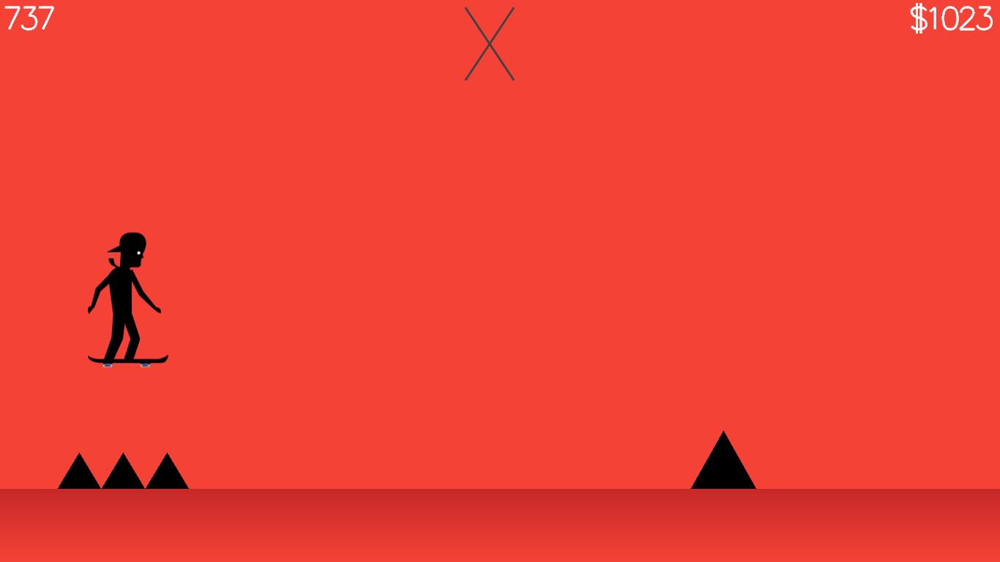

# ReMorse  (_REpresentative MORSe Educator_)
[](https://travis-ci.com/RaghavaDhanya/ReMorse)
[](https://github.com/RaghavaDhanya/ReMorse/blob/master/LICENSE)
## Morse Code 

> Morse code is a method of transmitting text information as a series of on-off tones, lights, or clicks that can be directly understood by a skilled listener or observer without special equipment. It is named for Samuel F. B. Morse, an inventor of the telegraph. 

## Motive 

The project is aimed at making the process of learning Morse code fun and intuitive. It tries to train the mind to subconsciously learn the binary sequence in an encoded message. 
> Associative learning is the process by which someone learns an association between two stimuli, or a behavior and a stimulus.

## Abstract 

The project is built as a 2D side scrolling game using openGL. It consists of a main character whose objective is to avoid obstacles by jumping over them. The frequency of obstacles corresponds to the Morse representation of the letters shown on the screen. 

## Prerequisities

* [freeglut](http://freeglut.sourceforge.net/)
* [Box2D](https://box2d.org/)

For Ubuntu 14.04 and above use the following command to install prerequisities
```
sudo apt-get install freeglut3-dev libbox2d2.3.0 libbox2d-dev
```

## Compiling

For linux systems use compile.sh to compile.

## Screenshots





